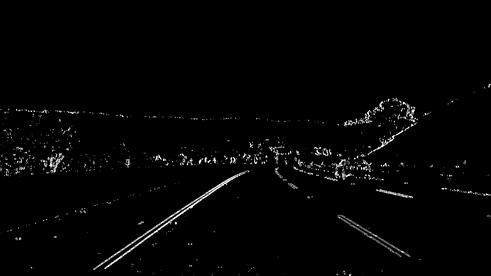

**Advanced Lane Finding Project**

The goals / steps of this project are the following:

* Compute the camera calibration matrix and distortion coefficients given a set of chessboard images.
* Apply a distortion correction to raw images.
* Use color transforms, gradients, etc., to create a thresholded binary image.
* Apply a perspective transform to rectify binary image ("birds-eye view").
* Detect lane pixels and fit to find the lane boundary.
* Determine the curvature of the lane and vehicle position with respect to center.
* Warp the detected lane boundaries back onto the original image.
* Output visual display of the lane boundaries and numerical estimation of lane curvature and vehicle position.

The code is presented in IPython notebook `lane_lines.ipynb`.

[//]: # (Image References)

[image1]: ./output_images/0_calibration1_original.jpg "Original Image"
[image2]: ./output_images/0_calibration1_undistorted.jpg "Undistorted Image"
[image3]: ./output_images/1_original.jpg
[image4]: ./output_images/1_undistorted.jpg
[image5]: ./output_images/color_fit_lines.jpg "Fit Visual"
[image6]: ./output_images/example_output.jpg "Output"
[video1]: ./project_video.mp4 "Video"

### Camera Calibration

#### Briefly state how you computed the camera matrix and distortion coefficients. Provide an example of a distortion corrected calibration image.

The code for this step is contained in the first and second code cells.

I start by preparing "object points", which will be the (x, y, z) coordinates of the chessboard corners in the world. Here I am assuming the chessboard is fixed on the (x, y) plane at z=0, such that the object points are the same for each calibration image.  Thus, `objp` is just a replicated array of coordinates, and `objpoints` will be appended with a copy of it every time I successfully detect all chessboard corners in a test image.  `imgpoints` will be appended with the (x, y) pixel position of each of the corners in the image plane with each successful chessboard detection.  

I then used the output `objpoints` and `imgpoints` to compute the camera calibration and distortion coefficients using the `cv2.calibrateCamera()` function.  I applied this distortion correction to the test image using the `cv2.undistort()` function and obtained this result:

Original Image             |  Undistorted Image
:-------------------------:|:-------------------------:
![alt_text][image1]        |  ![alt_text][image2] 

### Pipeline (single images)

#### 1. Provide an example of a distortion-corrected image.

In my pipeline I start by applying the distortion correction to one of the test images which looks like this (see code cell 3):

Original Image             |  Undistorted Image
:-------------------------:|:-------------------------:
![alt_text][image3]        |  ![alt_text][image4] 

#### 2. Describe how (and identify where in your code) you used color transforms, gradients or other methods to create a thresholded binary image.  Provide an example of a binary image result.

I used a combination of color and gradient thresholds to generate a binary image (see code cells 4 and 5). In function `get_binary_image` I calculate the absolute `x` Sobel  with thresholds `(30, 100)` and kernel equal to 3 where the input image is based on the `v` channel of the HSV color space (function `abs_sobel_thresh`):

Then I obtain a binary image for the `s` channel of the HLS color space. I apply the treshold values `(85, 255)` (function `hls_s_channel`)

The last part of combined binary image comes from the r channel of the RGB color space where the threshold `(215, 255)` is applied (function `rgb_r_channel`):

Combining the described above binaries results in the following image:

#### 3. Describe how (and identify where in your code) you performed a perspective transform and provide an example of a transformed image.

The code for my perspective transform includes (see code cells 6 and 7)
* finding source points on the undistorted test image with the straight lines:

* setting the destination points from which a rectangle on the "birds-eye view" is constructed.
The following source and destination points are obtained:

| Source        | Destination   | 
|:-------------:|:-------------:| 
| 267, 680      | 320, 720      | 
| 583, 460      | 320, 1        |
| 700, 460      | 920, 1        |
| 1046, 680     | 920, 720      |

* obtaining the transformed image on which the curvature can be measured. In the image below, the perspective transform is verified to be working as expected since the warped lane lines appear parallel:

#### 4. Describe how (and identify where in your code) you identified lane-line pixels and fit their positions with a polynomial?

Based on the lower half of the image, I find the line base from which the window sliding procedure begins (see code cell 8):

Next, I fit the found points with a 2nd order polynomial (see code cells 9 and 10):

#### 5. Describe how (and identify where in your code) you calculated the radius of curvature of the lane and the position of the vehicle with respect to center.

Taking into account that the line width is 3.7 meters and the dashed line length is 3 meters, I calculate the radius of curvature in the real world space (see code cell 12). The radius is calculated as follows:

$$R_{curve}=\frac{\left[1+\left(\frac{dx}{dy}\right)^2\right]^{3/2}}{\left|\frac{d^2x}{dy^2}\right|} = \frac{\left(1 + (2Ay + B)^2\right)^{3/2}}{|2A|},$$
where A and B are the first and second coefficients of the fitting 2nd order polynomial. To display the final curvature radius, I take the average of the left and right lane line radiuses.

When computing the offset from the center of the road, I assume that the camera is located exactly in the middle of the car. This implies that the center of the image and the center of the car coincide. The negative (positive) values of the offset are shown when the car is driving to the left (right) of the road center.

#### 6. Provide an example image of your result plotted back down onto the road such that the lane area is identified clearly.
I implement this step in code sell 13. The example of my result on a test image:

In this frame, the car is driving in the middle of the road, and the road has the 1.5km curvature radius.

### Pipeline (video)

#### Provide a link to your final video output.  Your pipeline should perform reasonably well on the entire project video (wobbly lines are ok but no catastrophic failures that would cause the car to drive off the road!).

Here's a [link to my video result](./project_video_output.mp4).
For each video frame, if the lane lines are found, the 2nd degree polynomial coefficients are averaged over the last 10 frames (see code cell 15, lines 71-85). This approach reduces the number of outliers and makes the fitted lines to be smoother.

### Discussion

#### 1. Briefly discuss any problems / issues you faced in your implementation of this project.  Where will your pipeline likely fail?  What could you do to make it more robust?
The pipeline might fail to detect the lane lines in the shadows. The L channel (luminosity) of the HLS color space might help avoid shadows and portions with dark pixels on the road.

The lane lines with high curvature might not be detected correctly. The sliding window approach chosen in this project, especially the method that finds the line base according to the lower half of a frame, might fail to recognize the lane lines in this case. Skipping the sliding windows step once the line positions are known and searching for the lines in a margin around the previous line position instead might help to overcome this problem.
